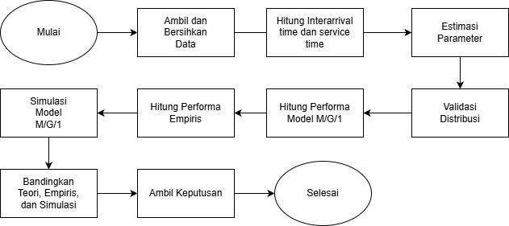

# 💸🛎️📊ANALISIS KINERJA SISTEM ANTRIAN MENGGUNAKAN MODEL M/G/1 (STUDI KASUS: KASIR KANTIN BKL (BUKIT KIARA LESTARI) INSTITUT TEKNOLOGI SUMATERA) 

## 📑Description
Repositori ini berisikan data, kode R, dan file tambahan lainnya mengenai Analisis Kinerja Sistem Antrian Menggunakan Model M/G/1 (STUDI KASUS: Kasir Kantin BKL ITERA).

## 🎯Goals
1. Mengidentifikasi dan memvalidasi distribusi data waktu kedatangan dan waktu pelayanan pada kasir Kantin Bukit Kiara Lestari (BKL) untuk menentukan model antrian yang sesuai. 
2. Menghitung ukuran kinerja sistem antrian yang meliputi tingkat utilisasi (ρ), rata-rata jumlah pelanggan dalam antrian (Lq) dan sistem (LS), serta rata-rata waktu tunggu dalam antrian (Wq) dan sistem (Ws) menggunakan formula Pollaczek-Khinchine untuk model M/G/1. 
3. Membandingkan hasil analisis teoretis, hasil simulasi, dan data aktual untuk   mengevaluasi efisiensi sistem antrian yang berjalan. 

## ⚙️Technologies Used
### Language
- R
### Libraries
- readr (Untuk membaca file CSV menjadi data frame/tibble yang siap diolah.)
- MASS (Untuk fungsi distribusi dan pemodelan statistik lanjutan seperti parameterisasi distribusi.)
- fitdistrplus (Untuk fitting distribusi probabilitas pada data dan evaluasi kecocokan distribusi.)
- tibble (Untuk struktur data modern sebagai pengganti data.frame dengan perilaku yang lebih konsisten.)
- dplyr (Untuk manipulasi data seperti filter, select, mutate, group_by, summarise.)
- ggplot2 (Untuk visualisasi data berbasis grammar of graphics.)

## 📂Method
Diagram alir proses analisis kinerja sistem antrian menggunakan model M/G/1 yang digunakan dalam proyek ini:

## 🔎Main Results
### Identifikasi dan validasi distribusi interarrival dan service time
#### Distribusi interarrival time

Distribusi waktu antar kedatangan menunjukkan pola menurun seperti eksponensial, dan itik data mengikuti garis teoretis sehingga cocok dengan distribusi eksponensial.
#### Distribusi service time

### Perhitungan ukuran kinerja sistem antrian

### Evaluasi dan perbandingan hasil analisis teoretis, hasil simulasi, dan data aktual (empiris)

## 👥Authors
**Presilia**
presilia.122450081@student.itera.ac.id

**Fadhil  Fitra Wijaya**
fadhil.122450082@student.itera.ac.id

**Reynaldi Rahmad**
reynaldi.122450088@student.itera.ac.id

**Irvan alfaritzi**
irvan.122450093@student.itera.ac.id
