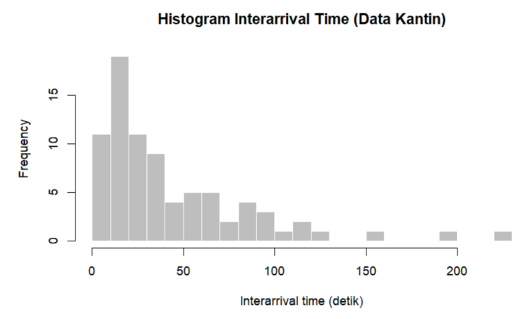
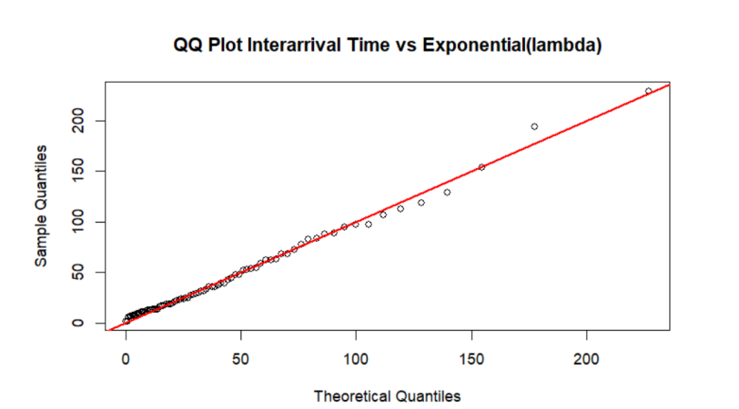
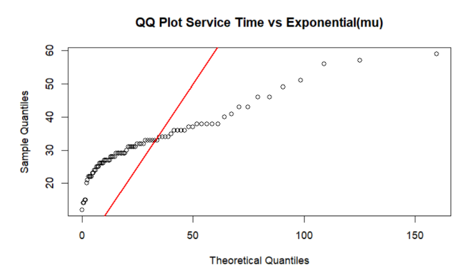
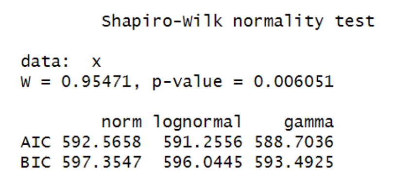

# 💸🛎️📊ANALISIS KINERJA SISTEM ANTRIAN MENGGUNAKAN MODEL M/G/1 (STUDI KASUS: KASIR KANTIN BKL (BUKIT KIARA LESTARI) INSTITUT TEKNOLOGI SUMATERA) 

## 📑Description
Repositori ini berisikan data, kode R, dan file tambahan lainnya mengenai Analisis Kinerja Sistem Antrian Menggunakan Model M/G/1 (STUDI KASUS: Kasir Kantin BKL ITERA).

## 🎯Goals
1. Mengidentifikasi dan memvalidasi distribusi data waktu kedatangan dan waktu pelayanan pada kasir Kantin Bukit Kiara Lestari (BKL) untuk menentukan model antrian yang sesuai. 
2. Menghitung ukuran kinerja sistem antrian yang meliputi tingkat utilisasi (ρ), rata-rata jumlah pelanggan dalam antrian (Lq) dan sistem (LS), serta rata-rata waktu tunggu dalam antrian (Wq) dan sistem (Ws) menggunakan formula Pollaczek-Khinchine untuk model M/G/1. 
3. Membandingkan hasil analisis teoretis, hasil simulasi, dan data aktual untuk   mengevaluasi efisiensi sistem antrian yang berjalan. 

## ⚙️Technologies Used
### Language
- R
### Libraries
- readr (Untuk membaca file CSV menjadi data frame/tibble yang siap diolah.)
- MASS (Untuk fungsi distribusi dan pemodelan statistik lanjutan seperti parameterisasi distribusi.)
- fitdistrplus (Untuk fitting distribusi probabilitas pada data dan evaluasi kecocokan distribusi.)
- tibble (Untuk struktur data modern sebagai pengganti data.frame dengan perilaku yang lebih konsisten.)
- dplyr (Untuk manipulasi data seperti filter, select, mutate, group_by, summarise.)
- ggplot2 (Untuk visualisasi data berbasis grammar of graphics.)

## 📂Method
Diagram alir proses analisis kinerja sistem antrian menggunakan model M/G/1 yang digunakan dalam proyek ini:

## 🔎Main Results
### Identifikasi dan validasi distribusi interarrival dan service time
#### Distribusi interarrival time
 

Distribusi waktu antar kedatangan menunjukkan pola menurun seperti eksponensial, dan itik data mengikuti garis teoretis sehingga cocok dengan distribusi eksponensial.

#### Distribusi service time
 

Pola data tidak simetris menandakan service time tidak mengikuti eksponensial. Titik menjauhi garis lurus sehingga asumsi eksponensial ditolak. Maka dilakukan uji distribusi lain

 

Dilakukan uji Shapiro-Wilk hasilnya menunjukkan p-value < 0.05 sehingga distribusi normal ditolak. Maka dilakukan perbandingan beberapa kandidat distribusi dan Gamma memiliki nilai AIC dan BIC paling kecil, sehingga distribusi untuk service time adalah distribusi Gamma. **Maka terpilihlah model M/G/1 mengikuti interarrival time yang berdistribusi eksponensial, service time yang berdistribusi gamma, dan 1 server pelayanan yang diobservasi.**

### Perhitungan ukuran kinerja sistem antrian M/G/1
Model M/G/1 digunakan untuk kedatangan Markovian (M) dan pelayanan berdistribusi Gamma/General (G) dengan satu pelayan. Parameter yang diperoleh adalah :  
-Laju kedatangan (λ) = 0,0224 pelanggan/detik. 
-Rata-rata pelayanan (E[S]) = 31,40 detik. 
-Variansi pelayanan (Var(S)) = 84,84. 
-Faktor utilisasi (ρ) = 0,704 (70,4%). 

**Hasil Performa Simulasi M/G/1**

| Metrik | Nilai |
|---|---:|
| L_sim (jumlah pelanggan dalam sistem) | 2.995 |
| Lq_sim (jumlah pelanggan dalam antrian) | 2.096 |
| W_sim (waktu total dalam sistem, detik) | 133.538 |
| Wq_sim (waktu tunggu antrian, detik) | 93.422 |

Server tidak overload karena utilisasi masih di bawah 1. Namun, variabilitas pelayanan yang cukup besar menyebabkan waktu tunggu semakin memanjang meskipun sistem masih dalam kondisi stabil.

### Evaluasi dan perbandingan hasil analisis teoretis, hasil simulasi, dan data aktual (empiris)

**Tabel Perbandingan Hasil**

| Metrik | Teori | Empiris | Simulasi |
|---|---:|---:|---:|
| Lq (pelanggan dalam antrian) | 0.91 | 2.70 | 2.10 |
| L (pelanggan dalam sistem) | 1.61 | 3.40 | 2.99 |
| Wq (waktu tunggu dalam antrian, detik) | 40.57 | 120.27 | 93.42 |
| W (waktu total dalam sistem, detik) | 71.97 | 151.67 | 133.54 |

**Penjelasan singkat:**  
Hasilnya nilasi empiris seluruh metrik lebih tinggi dibandingkan prediksi teoritis. Seperti pada metrik Lq (jumlah pelanggan menunggu), teori memprediksi 0.9 orang tetapi kenyataan mencapai 2.6 orang, dan simulasi memberikan nilai 2.1 orang yang lebih mendekati kondisi nyata. Hal yang sama terjadi pada metrik L (jumlah dalam sistem), Wq (lama pelanggan menunggu), dan W (total waktu dalam sistem) yang nilai teorisnya jauh lebih rendah dibandingkan nilai empiris dan simulasi. Perbedaan besar paada nilai teori ini disebabkan oleh variasi lama pelayanan pada keadaan nyata, sementara simulasi dapat menangkap kondisi fluktuatif sehingga menghasilkan estimasi yang berada di antara nilai ideal teori dan kondisi empiris.

## 👥Authors
**Presilia**
presilia.122450081@student.itera.ac.id

**Fadhil  Fitra Wijaya**
fadhil.122450082@student.itera.ac.id

**Reynaldi Rahmad**
reynaldi.122450088@student.itera.ac.id

**Irvan alfaritzi**
irvan.122450093@student.itera.ac.id
